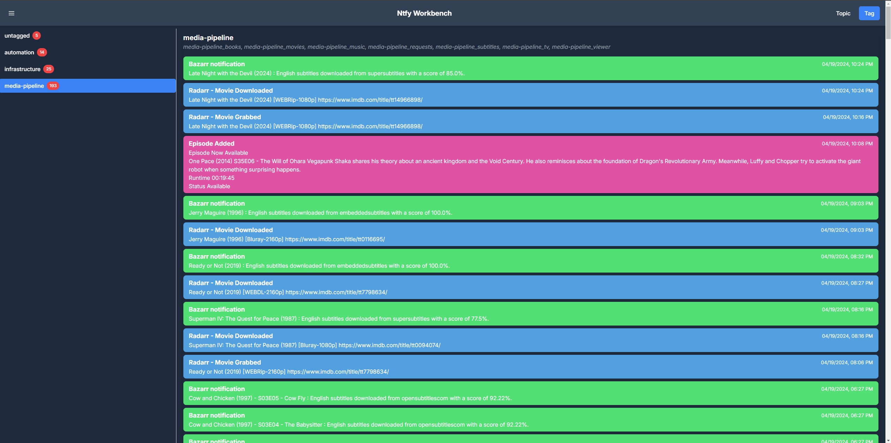

# NTFY Workbench

A simple web app to manage [ntfy.sh](https://ntfy.sh) topics. It allows you to configure topics so that you can view by topic or by tag. Tagging allows you to group related topics together to make it easier to get a quick overview of what's happening for a particular project or area of interest. You can have as many tags as you want for a topic so you can group them pretty much however you would like.

By Topic View


By Tag View


## Features

- View topics by tag
- View topics by topic
- Message counter for topics and tags
- Mobile friendly view (probably not perfect but it works pretty decently)
- Adjusts to dark or light mode based on your system settings
- Generates colors for messages based on the topic name

## Planned Features

- Message acknowledgements (mark as read)
- Ability to configure a webhook for a topic or tag with potential filtering by message contents
- Ability to configure everything from the UI (currently requires a config file)
- Maybe some other shit but I work on this in my free time so bear with me
- Ability to configure dark or light mode in configuration

## Running the app

Using Docker is the easiet way to run the app, but you can also build it locally.

### Example config.json

```json
{
  "topics": [
    {
      "name": "test",
      "description": "test description",
      "tags": ["tag1"]
    },
    {
      "name": "test2",
      "description": "test description",
      "tags": ["tag1", "tag2"]
    },
    {
      "name": "test3"
    }
  ],
  ,
  "ntfy": {
    "url": "https://ntfy.sh",
    "apiKey": "your-api-key"
  }
}
```

### Docker

#### Docker Run

1. Create a `config.json` file and drop it in the desired directory. See the example above.

2. Run `docker run -p 3000:3000 -v /path/to/config:/app/config ghcr.io/mzrimsek/ntfy-workbench:latest`

3. Access the app at `http://localhost:3000`

#### Docker Compose

1. Create a `config.json` file and drop it in the desired directory. See the example above.

2. Download the `docker-compose.yml` file from the repository.

3. Create `.env` file in the root directory with the following content:

```shell
CONFIG_DIR=/path/to/folder/with/config
```

4. Run the app from the root directory

```shell
docker-compose up -d
```

4. Access the app at `http://localhost:3000`

#### Build the Image

1. Pick a directory for your config location

2. Create a `config.json` file and drop it in the desired directory. See the example above.

3. Build the image

```shell
docker build -t ntfy-workbench .
```

4. Run the image

```shell
docker run -p 3000:3000 -v /path/to/config:/app/config ntfy-workbench
```

5. Access the app at `http://localhost:3000`

### Locally

1. Install dependencies

```shell
npm install
```

2. Create a `config.json` file and drop it in the config folder. See the example above.

3. Start the app

```shell
npm run dev
```
