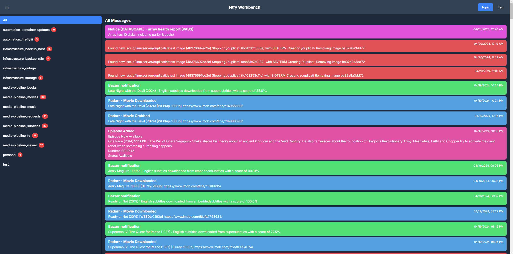

# NTFY Workbench

A simple web app to manage [ntfy.sh](https://ntfy.sh) topics. It allows you to configure topics so that you can view by topic or by tag.

 

## 📖 Documentation

**Complete documentation is available in the [📚 GitHub Wiki](https://github.com/mzrimsek/ntfy-workbench/wiki)**

- **[🚀 Setup Guide](https://github.com/mzrimsek/ntfy-workbench/wiki/Setup)** - Docker & local development
- **[⚙️ Configuration](https://github.com/mzrimsek/ntfy-workbench/wiki/Configuration)** - Topics, tags, and colors
- **[✨ Features](https://github.com/mzrimsek/ntfy-workbench/wiki/Features)** - What the app can do
- **[🛠️ Development](https://github.com/mzrimsek/ntfy-workbench/wiki/Development)** - Contributing guide

> 📝 **Note**: Wiki documentation is maintained as a git submodule in the [`wiki/`](./wiki/) directory.## Quick Start

```bash
# Create config directory and file
mkdir config
# Add your config.yaml (see Configuration wiki page)

# Run with Docker
docker run -p 3000:3000 \
  -v $(pwd)/config:/app/config \
  ghcr.io/mzrimsek/ntfy-workbench:latest
```

Access at: http://localhost:3000

## Key Features

- 📱 **Mobile-friendly** responsive design
- 🏷️ **Tag-based organization** - group related topics
- 🎨 **Customizable colors** - custom or auto-generated
- 🌓 **Dark/light mode** - follows system preferences
- 📊 **Message counters** - for topics and tags

## Contributing

Contributions are welcome! Please see the [Development Guide](https://github.com/mzrimsek/ntfy-workbench/wiki/Development) in the wiki for details on:

- Development setup
- Code conventions
- Commit message format
- Pull request process

### Updating Documentation

Documentation is maintained in the `wiki/` directory as a git submodule:

```bash
cd wiki
# Edit documentation files
git add .
git commit -m "docs: update documentation"
git push origin master
```
